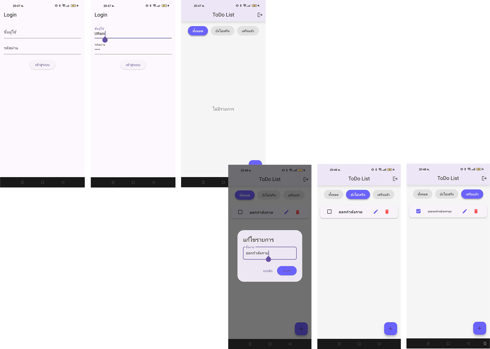

# FlutterToDoList

พัฒนาโดย 

สมาชิก

นายจักรภัทร หอมกระจาย 6612732106

นายนันทพัฒท์ นามคุณ 66127321116

นายปวเรศ ใจธรรม 6612732120

นายรัชชานนท์ ทองแดงดี 6612732124

สาขาวิทยาการคอมพิวเตอร์, คณะศิลปศาสตร์และวิทยาศาสตร์ มหาวิทยาลัยราชภัฏศรีสะเกษ

**Description:**

โปรแกรม Simple Todo List หรือ โปรแกรมบันทึกสิ่งที่ต้องทำอย่างง่าย ใช้การบันทึก - อ่านข้อมูลแบบ JSON แบบ Local เพื่อบันทึกข้อมูลสิ่งต่าง ๆ ที่ต้องทำเอาไว้

เป็นโปรแกรมเพื่อใช้สำหรับการสาธิตให้นักศึกษาได้เรียนรู้ และเข้าใจในเรื่องการการสร้่างข้อมูลให้อยู่ในรูปแบบโครงสร้่างของ JSON และการ อ่าน - เขียน ไฟล์ในโมบายแอบพลิเคชั่น

โมบายแอปพลิเคชั่นนี้พัฒนาขึ้นเพื่อใช้เป็นสื่อการเรียนการสอน และตัวอย่างในกรณีศึกษาการพัฒนาโมบายแอปพลิเคชั่นด้วย Flutter ในรายวิชาการพัฒนาโปรแกรมบนมือถือ

เพื่อให้นักศึกษาได้ใช้สำหรับการศึกษา ทดลองปฏิบัติตาม ให้เกิดความรู้ ความเข้าใจ และทักษะในการพัฒนาโปรแกรมบนมือถือด้วย Flutter

1. **เข้าสู่ระบบ (Login)**
   - กรอกชื่อผู้ใช้ (Username)
   - กรอกรหัสผ่าน (Password)
   - กดปุ่ม **เข้าสู่ระบบ** เพื่อไปยังหน้าหลัก

2. **หน้า ToDo List**
   - แบ่งงานออกเป็น 3 แท็บ:
     - **ทั้งหมด** (All)
     - **ยังไม่เสร็จ** (Pending)
     - **เสร็จแล้ว** (Completed)
   - สามารถเพิ่ม, แก้ไข, และลบงานได้
   - กด checkbox เพื่อเปลี่ยนสถานะงานเป็นเสร็จแล้วหรือยังไม่เสร็จ

3. **เพิ่มงาน**
   - ปุ่ม `+` ที่มุมล่างขวาสำหรับเพิ่มรายการใหม่

4. **แก้ไขงาน**
   - กดไอคอนดินสอ ✏️ เพื่อแก้ไขชื่องาน

5. **ลบงาน**
   - กดไอคอนถังขยะ 🗑 เพื่อลบงานออกจากรายการ

## ตัวอย่างหน้าจอ User Interface

